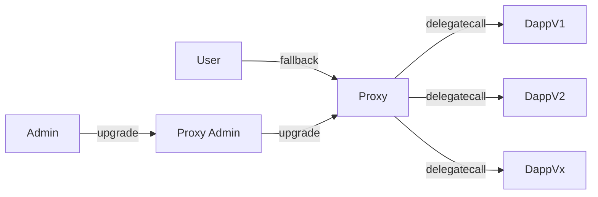

# 架构设计


# 程序设计
## 数据结构
1. `Proplsal`保存了一个投票提案的相关信息
    ```solidity
        struct Proposal {
            uint256 id;
            address nftAddress;
            Round[] rounds;
            bool status;
        }
    ```
    1. `id`代表了本次投票提案的编号,自动分配,在合约中id从1开始,每次调用`createProposal()`都会自增
    2. `nftAddress`表示该提案允许使用的基于ERC721发行NFT的地址,只有该地址铸造的nft才能参与本提案的投票活动
    3. `rounds`中保存轮次的相关信息，调用`setProposalRounds()`可以设置提案的轮次信息
    4. `status`控制投票提案活动暂停/进行的状态,在初次调用`createProposal()`可设置，也可单独调用`setProposalStatus()`控制

2. `Round`保存了一个投票提案中一个轮次内的时间和限制投票信息
    ```solidity
        struct Round {
            uint256 startTime;
            uint256 endTime;
            bool limitedToOneVote;
        }
    ```
    1. `startTime`和`endTime`使用Unix时间戳来控制该轮次投票活动的开始与结束时间
    2. `limitedToOneVote`为false时,用户在该轮次的可多次投票;为true时,用户在本轮次只能进行一次投票

3. `mapping(uint256 => Proposal) public proposals` index => Proposal 索引对应一个提案(索引从1开始)
4. `mapping(uint256 => mapping(uint256 => uint256)) public winners` proposalId => round => votee 标记提案的某轮投票胜者
5. `mapping(uint256 => mapping(uint256 => uint256)) public votes` tokenId => proposalId => votee 标记token投给哪个提案的哪个候选人
6. `mapping(address => mapping(uint256 => bool)) public hasVoted` nftaddress => tokenId => bool 某nft地址的tokenId是否投过票
7. `mapping(uint256 => uint256 ) public proposalCounts` proposalId => vote count 保存提案获得的总票数
8. `mapping(uint256 => mapping(uint256 => uint256)) public roundsCounts` proposalId => round => vote count 某个提案某轮次总共获得票数
9. `mapping(uint256 => mapping(uint256 => mapping(address => uint256))) public userCounts` proposalId => round => user => vote count 某个提案某轮次中某用户总共投出票数
10. `mapping(uint256 => mapping(uint256 =>  mapping(uint256 => uint256))) public voteeCounts` proposalId => round => votee => vote count 某个提案某轮次某候选人获得票数

## 主要函数
1. `createProposal()` 创建投票提案(仅ADMIN_ROLE可用)
2. `setProposalRounds()` 设置提案的轮次信息(仅ADMIN_ROLE可用)
3. `setProposalStatus()` 设置提案的状态 进行/暂停(仅ADMIN_ROLE可用)
4. `vote()` 投票功能, `castVote()`是internal函数用于辅助完成`vote()`的功能
5. `setWinner()` 设置某天某轮次的胜者(仅ADMIN_ROLE可用)
6. `getProposalRound()` 返回当前提案共有多少轮次
7. `getCurrentRoundIndex()` 返回当前提案进行到的轮次的索引(从0开始表示第一个轮次)

## 事件
1. `event CreateProposalEvent(uint256 proposalId, bool status)` 创建投票提案
2. `event SetRoundsEvent(uint256 proposalId, Round[] rounds)` 设置提案轮次
3. `event SetStatusEvent(uint256 proposalId, bool status)` 设置提案状态
4. `event VoteEvent(uint256 proposalId, uint256 round, uint256 votee, address voter, uint256[] tokenIds)` 投票
5. `event SetWinnerEvent(uint256 proposalId, uint256 round, uint256 winner)` 设置提案轮次的胜者

# 使用说明
1. 部署合约,首次部署后需要调用`initialize()`,仅能调用一次,调用者会获取合约权限
2. 创建提案,调用`createProposal()`,还需调用`setProposalRounds()`初始化轮次信息
3. 可以调用`vote()`进行投票了
4. 单元测试:

    ```bash
    Voting
      create proposal
        ✔ should allow owner create proposal
        ✔ reverts when non-owner tries to create proposal
      set Proposal Rounds
        ✔ should allow owner set proposal rounds
        ✔ should allow owner adjust round information (44ms)
        ✔ reverts when non-owner tries to set Proposal Rounds
      set Proposal Status
        ✔ should allow owner set proposal status
        ✔ reverts when non-owner tries to set proposal status
      vote
        ✔ should allow voters use tokens for voting (56ms)
        ✔ should voting only once within a limited round
        ✔ reverts when voter tries to vote that proposal has not yet started
        ✔ reverts when voter tries to vote at the wrong time
        ✔ reverts when voter tries to vote with the wrong tokenId (41ms)
        ✔ reverts when voter tries to vote with tokenId that have already been used
      set winner
        ✔ should allow owner set winner
        ✔ reverts when non-owner tries to set winner
      access control
        ✔ should allow owner control role (83ms)
        ✔ should return whether address has permission
    ```


# 可升级合约(透明代理)
## 部署步骤
1. 实现可升级功能需要部署三个合约
    1. `MyVote`合约,这是实现投票功能的逻辑合约`logic contract`
    2. `ProxyAdmin`合约,这是用于升级、管理代理合约和逻辑合约的管理员合约`addmin contract`
    3. `TransparentUpgradeableProxy`合约,它利用`delegatecall`调用逻辑合约功能，但状态却存储至本合约之中,代理合约`proxy contract`
2. 需要依次部署`logic contract`,`addmin contract`,`proxy contract`(代理合约部署时需要传入前两个合约的合约地址作为参数，还有一个初始化数据，用于在部署时初始化合约状态的参数)
3. 部署上述三个合约成功后，我们就可以通过调用proxy合约中的方法实现这种代理模式
    1. 在使用js/ts调用proxy时，需要先获取其实例,才能通过调用`proxy contract`使用`logic contract`中的方法
    ```typescript
        const tmp = fs.readFileSync(`artifacts/contracts/Voting/VotingV1.sol/VoteV1.json`, 'utf-8');
        const artifact = JSON.parse(tmp);
        contractInstanceV1 = new ethers.Contract(proxyAddress, artifact1.abi, owner);
    ```
    2. 获取合约实例后，我们就可以正常使用`logic contract`中的方法
    ```typescript
        await contractInstanceV1.createProposal(nftAddress, true); // 创建投票提案
        await contractInstanceV1.setProposalRounds(proposalId, rounds); // 设置提案的轮次信息
        await contractInstanceV1.vote(proposalId, votee0, tokenId1); // 进行投票
    ```
## 合约升级
1. 若合约需要进行功能改进或bug修复，我们就需要用到合约升级功能
2. 将新的`logicV2 contract`部署链上，获取其合约地址
3. 调用`admin contrat`中的`upgrade()`就可以完成升级了
    ```typescript
        await admin.upgrade(proxyAddress, logicV2Address); // 升级合约
        const tmp = fs.readFileSync(`artifacts/contracts/Voting/VotingV2.sol/VoteV2.json`, 'utf-8');
        const artifact = JSON.parse(tmp);
        contractInstanceV2 = new ethers.Contract(proxyAddress, artifact.abi, owner);
    ```
4. 升级之后再调用proxy执行的逻辑就遵循`logicV2 contract`,同时从前在`logicV1 contract`执行后保存的状态依旧会得到保留和继承
## 单元测试
单元测试主要测试`admin contrat`的`upgarde()`功能
4. 单元测试:

    ```bash
    Voting
      test logicV1 contract
      ✔ should return correct state
    test logicV2 contract
      ✔ should return correct state
    test admin contract
      upgrade
        ✔ should allow owner upgrade contract
        ✔ reverts when non-owner tries to upgrade
      changeProxyAdmin
        ✔ reverts when non-owner tries to change proxy admin
      transferOwnership
        ✔ should allow owner transfer ownership
        ✔ reverts when non-owner tries to transfer ownership
    ```
